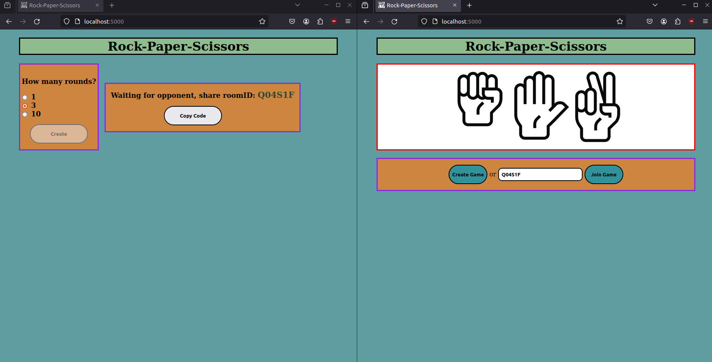
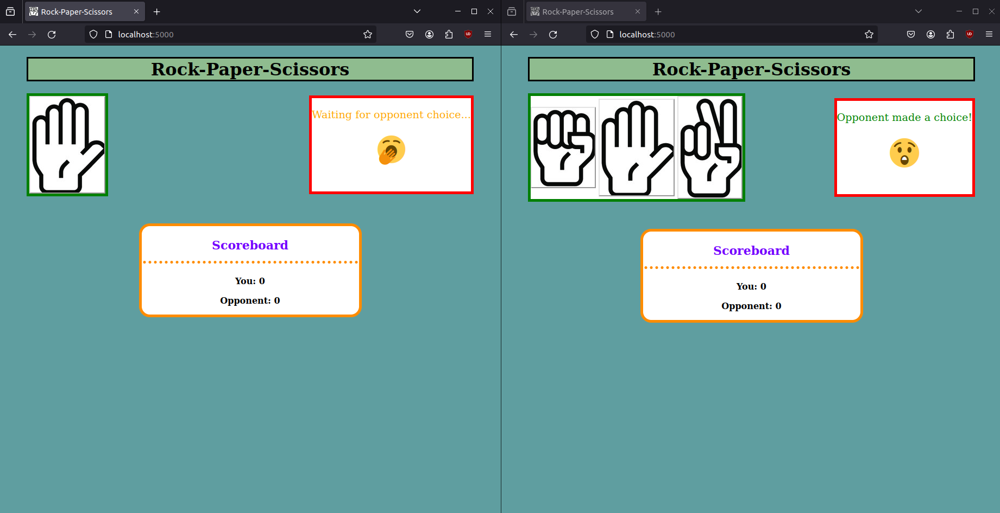
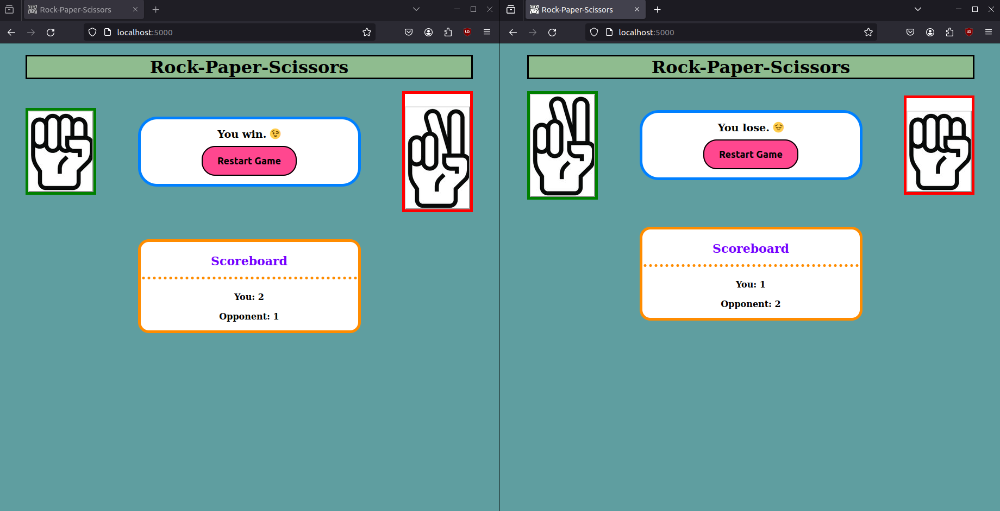
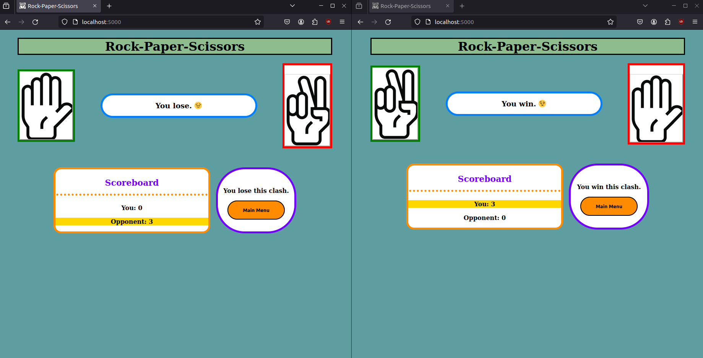

# Rock-Paper-Scissors - WebGame 

## Description

This project is a web-based implementation of the classic game Rock-Paper-Scissors, utilizing `WebSocket` technology and built with `node.js` + ***express***. It allows for asynchronous communication between multiple clients and a server. The server is capable of handling multiple simultaneous games and ensures synchronization of client actions.

## Features

* `WebSocket Communication` - Utilizes WebSocket protocol for real-time bidirectional communication between clients and server.

* `Multiplayer Support` - Enables cooperation between at least 2 players, ensuring synchronized gameplay through the server.
    * After creating a room, we get a **roomID** which the second player can use to join. There is a limit of 2 players for each roomID. If there are more interested players, they must create another room.

* `Optimization` - Focuses on optimizing both client and server performance, minimizing resource usage and the number of transmitted messages.

* `Binary Message Transfer` - Utilizes binary WebSocket messages for efficient data transfer between server and clients.

* `Canvas Rendering` - Implements the part of game visualization using the canvas element.

* `Browser Compatibility` - Compatible with modern web browsers including Firefox, Chrome etc.

## How the game looks like
* Menu

* Gameplay

